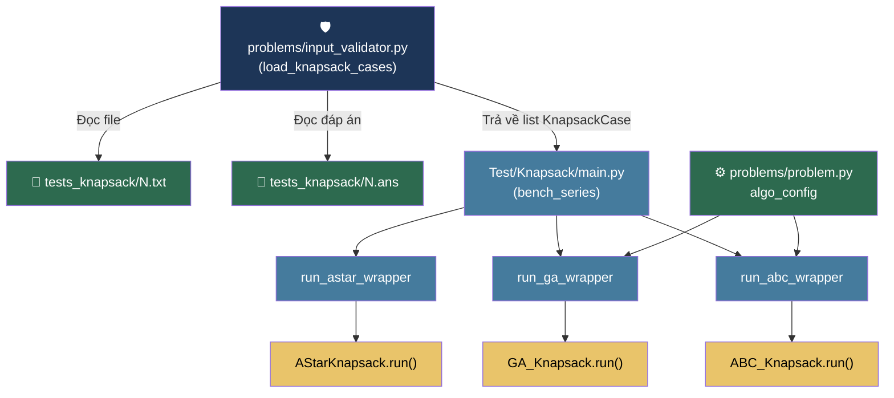
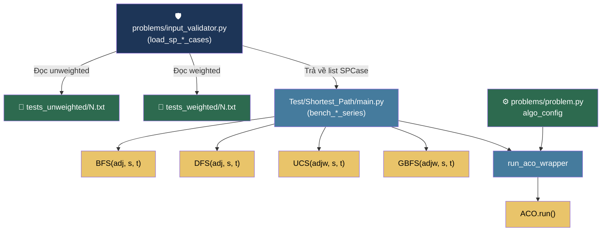
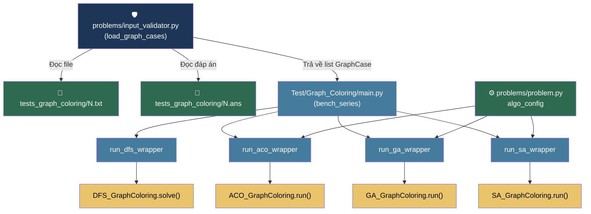
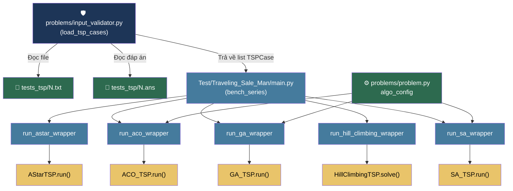
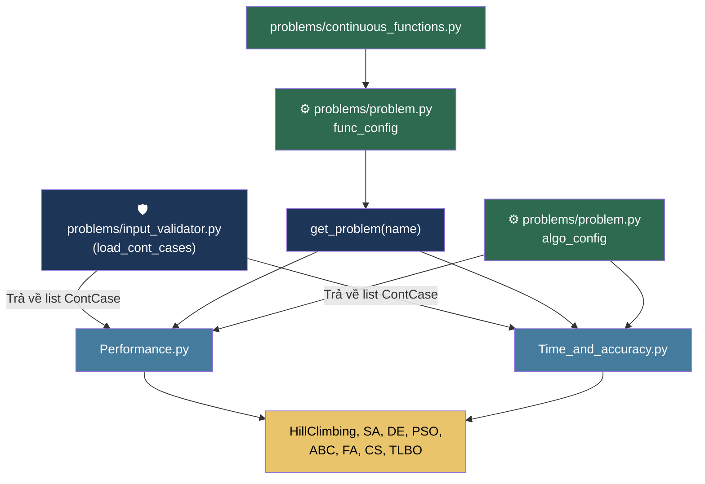

# 🗺️ Project Traceability Map

Phiên bản: 2026-03-13 | Người tạo: Antigravity AI

---

## 1. Điểm khởi chạy (Entry Points)

| File | Mô tả | Cách chạy |
|---|---|---|
| [main.py](file:///Users/shelterin/Library/CloudStorage/OneDrive-Personal/Study/Nam2/HK1/HCMUS_CSC14003_Project_1/main.py) | Menu chính, gọi subprocess đến từng benchmark | `python main.py` → chọn 1-7 |
| [Test/Knapsack/main.py](file:///Users/shelterin/Library/CloudStorage/OneDrive-Personal/Study/Nam2/HK1/HCMUS_CSC14003_Project_1/Test/Knapsack/main.py) | Benchmark Knapsack độc lập | `python main.py` (trong thư mục) |
| [Test/Shortest_Path/main.py](file:///Users/shelterin/Library/CloudStorage/OneDrive-Personal/Study/Nam2/HK1/HCMUS_CSC14003_Project_1/Test/Shortest_Path/main.py) | Benchmark Shortest Path độc lập | `python main.py` |
| [Test/Graph_Coloring/main.py](file:///Users/shelterin/Library/CloudStorage/OneDrive-Personal/Study/Nam2/HK1/HCMUS_CSC14003_Project_1/Test/Graph_Coloring/main.py) | Benchmark Graph Coloring độc lập | `python main.py` |
| [Test/Traveling_Sale_Man/main.py](file:///Users/shelterin/Library/CloudStorage/OneDrive-Personal/Study/Nam2/HK1/HCMUS_CSC14003_Project_1/Test/Traveling_Sale_Man/main.py) | Benchmark TSP độc lập | `python main.py` |
| [Test/Continuous_Optimization/main.py](file:///Users/shelterin/Library/CloudStorage/OneDrive-Personal/Study/Nam2/HK1/HCMUS_CSC14003_Project_1/Test/Continuous_Optimization/main.py) | Benchmark Continuous Optimization | `python main.py` |
| [visualization/main.py](file:///Users/shelterin/Library/CloudStorage/OneDrive-Personal/Study/Nam2/HK1/HCMUS_CSC14003_Project_1/visualization/main.py) | Trực quan hóa 3D animation thuật toán | `python main.py` (standalone) |

---

## 2. Bảng Mapping: Thuật toán ↔ Bài toán

### 2A. Bài toán Rời rạc (Discrete Optimization)

| Thuật toán | Viết tắt | Bài toán | Loại | File Cài đặt | File Benchmark (Wrapper) |
|---|---|---|---|---|---|
| A-Star | A* | Knapsack (0/1) | Classical | [A_star_Knapsack.py](file:///Users/shelterin/Library/CloudStorage/OneDrive-Personal/Study/Nam2/HK1/HCMUS_CSC14003_Project_1/classical/informed/A_star_Knapsack.py) | [Knapsack/main.py](file:///Users/shelterin/Library/CloudStorage/OneDrive-Personal/Study/Nam2/HK1/HCMUS_CSC14003_Project_1/Test/Knapsack/main.py) → [run_astar_wrapper](file:///Users/shelterin/Library/CloudStorage/OneDrive-Personal/Study/Nam2/HK1/HCMUS_CSC14003_Project_1/Test/Knapsack/main.py#115-125) |
| A-Star | A* | TSP | Classical | [A_star_TSP.py](file:///Users/shelterin/Library/CloudStorage/OneDrive-Personal/Study/Nam2/HK1/HCMUS_CSC14003_Project_1/classical/informed/A_star_TSP.py) | [TSP/main.py](file:///Users/shelterin/Library/CloudStorage/OneDrive-Personal/Study/Nam2/HK1/HCMUS_CSC14003_Project_1/Test/Traveling_Sale_Man/main.py) → [run_astar_wrapper](file:///Users/shelterin/Library/CloudStorage/OneDrive-Personal/Study/Nam2/HK1/HCMUS_CSC14003_Project_1/Test/Knapsack/main.py#115-125) |
| Breadth-First Search | BFS | Shortest Path (unweighted) | Classical | [breath_first_search_shortest_path.py](file:///Users/shelterin/Library/CloudStorage/OneDrive-Personal/Study/Nam2/HK1/HCMUS_CSC14003_Project_1/classical/uninformed/breath_first_search_shortest_path.py) | [Shortest_Path/main.py](file:///Users/shelterin/Library/CloudStorage/OneDrive-Personal/Study/Nam2/HK1/HCMUS_CSC14003_Project_1/Test/Shortest_Path/main.py) |
| Depth-First Search | DFS | Shortest Path (unweighted) | Classical | [depth_first_search_shortest_path.py](file:///Users/shelterin/Library/CloudStorage/OneDrive-Personal/Study/Nam2/HK1/HCMUS_CSC14003_Project_1/classical/uninformed/depth_first_search_shortest_path.py) | [Shortest_Path/main.py](file:///Users/shelterin/Library/CloudStorage/OneDrive-Personal/Study/Nam2/HK1/HCMUS_CSC14003_Project_1/Test/Shortest_Path/main.py) |
| Depth-First Search | DFS | Graph Coloring | Classical | [depth_first_search_graph_coloring.py](file:///Users/shelterin/Library/CloudStorage/OneDrive-Personal/Study/Nam2/HK1/HCMUS_CSC14003_Project_1/classical/uninformed/depth_first_search_graph_coloring.py) | [Graph_Coloring/main.py](file:///Users/shelterin/Library/CloudStorage/OneDrive-Personal/Study/Nam2/HK1/HCMUS_CSC14003_Project_1/Test/Graph_Coloring/main.py) → [run_dfs_wrapper](file:///Users/shelterin/Library/CloudStorage/OneDrive-Personal/Study/Nam2/HK1/HCMUS_CSC14003_Project_1/Test/Graph_Coloring/main.py#118-128) |
| Uniform Cost Search | UCS | Shortest Path (weighted) | Classical | [uniform_cost_search.py](file:///Users/shelterin/Library/CloudStorage/OneDrive-Personal/Study/Nam2/HK1/HCMUS_CSC14003_Project_1/classical/uninformed/uniform_cost_search.py) | [Shortest_Path/main.py](file:///Users/shelterin/Library/CloudStorage/OneDrive-Personal/Study/Nam2/HK1/HCMUS_CSC14003_Project_1/Test/Shortest_Path/main.py) |
| Greedy Best-First Search | GBFS | Shortest Path (weighted) | Classical | [greedy_best_first_search_shortest_path.py](file:///Users/shelterin/Library/CloudStorage/OneDrive-Personal/Study/Nam2/HK1/HCMUS_CSC14003_Project_1/classical/informed/greedy_best_first_search_shortest_path.py) | [Shortest_Path/main.py](file:///Users/shelterin/Library/CloudStorage/OneDrive-Personal/Study/Nam2/HK1/HCMUS_CSC14003_Project_1/Test/Shortest_Path/main.py) |
| Hill Climbing | HC | TSP | Classical | [hill_climbing_tsp.py](file:///Users/shelterin/Library/CloudStorage/OneDrive-Personal/Study/Nam2/HK1/HCMUS_CSC14003_Project_1/classical/local/hill_climbing_tsp.py) | [TSP/main.py](file:///Users/shelterin/Library/CloudStorage/OneDrive-Personal/Study/Nam2/HK1/HCMUS_CSC14003_Project_1/Test/Traveling_Sale_Man/main.py) → [run_hill_climbing_wrapper](file:///Users/shelterin/Library/CloudStorage/OneDrive-Personal/Study/Nam2/HK1/HCMUS_CSC14003_Project_1/Test/Traveling_Sale_Man/main.py#176-191) |
| Ant Colony Optimization | ACO | Shortest Path (weighted) | Nature-Inspire | [ant_colony_optimization.py](file:///Users/shelterin/Library/CloudStorage/OneDrive-Personal/Study/Nam2/HK1/HCMUS_CSC14003_Project_1/nature_inspire/biology_based/ant_colony_optimization/ant_colony_optimization.py) | [Shortest_Path/main.py](file:///Users/shelterin/Library/CloudStorage/OneDrive-Personal/Study/Nam2/HK1/HCMUS_CSC14003_Project_1/Test/Shortest_Path/main.py) → [run_aco_wrapper](file:///Users/shelterin/Library/CloudStorage/OneDrive-Personal/Study/Nam2/HK1/HCMUS_CSC14003_Project_1/Test/Shortest_Path/main.py#161-199) |
| Ant Colony Optimization | ACO | Graph Coloring | Nature-Inspire | [ant_colony_optimization_graph_coloring.py](file:///Users/shelterin/Library/CloudStorage/OneDrive-Personal/Study/Nam2/HK1/HCMUS_CSC14003_Project_1/nature_inspire/biology_based/ant_colony_optimization/ant_colony_optimization_graph_coloring.py) | [Graph_Coloring/main.py](file:///Users/shelterin/Library/CloudStorage/OneDrive-Personal/Study/Nam2/HK1/HCMUS_CSC14003_Project_1/Test/Graph_Coloring/main.py) → [run_aco_wrapper](file:///Users/shelterin/Library/CloudStorage/OneDrive-Personal/Study/Nam2/HK1/HCMUS_CSC14003_Project_1/Test/Shortest_Path/main.py#161-199) |
| Ant Colony Optimization | ACO | TSP | Nature-Inspire | [ant_colony_optimization_tsp.py](file:///Users/shelterin/Library/CloudStorage/OneDrive-Personal/Study/Nam2/HK1/HCMUS_CSC14003_Project_1/nature_inspire/biology_based/ant_colony_optimization/ant_colony_optimization_tsp.py) | [TSP/main.py](file:///Users/shelterin/Library/CloudStorage/OneDrive-Personal/Study/Nam2/HK1/HCMUS_CSC14003_Project_1/Test/Traveling_Sale_Man/main.py) → [run_aco_wrapper](file:///Users/shelterin/Library/CloudStorage/OneDrive-Personal/Study/Nam2/HK1/HCMUS_CSC14003_Project_1/Test/Shortest_Path/main.py#161-199) |
| Artificial Bee Colony | ABC | Knapsack | Nature-Inspire | [artificial_bee_colony_knapsack.py](file:///Users/shelterin/Library/CloudStorage/OneDrive-Personal/Study/Nam2/HK1/HCMUS_CSC14003_Project_1/nature_inspire/biology_based/artificial_bee_colony/artificial_bee_colony_knapsack.py) | [Knapsack/main.py](file:///Users/shelterin/Library/CloudStorage/OneDrive-Personal/Study/Nam2/HK1/HCMUS_CSC14003_Project_1/Test/Knapsack/main.py) → [run_abc_wrapper](file:///Users/shelterin/Library/CloudStorage/OneDrive-Personal/Study/Nam2/HK1/HCMUS_CSC14003_Project_1/Test/Knapsack/main.py#165-192) |
| Genetic Algorithm | GA | Knapsack | Nature-Inspire | [genetic_algorithm_knapsack.py](file:///Users/shelterin/Library/CloudStorage/OneDrive-Personal/Study/Nam2/HK1/HCMUS_CSC14003_Project_1/nature_inspire/evolution_based/genetic_algorithm/genetic_algorithm_knapsack.py) | [Knapsack/main.py](file:///Users/shelterin/Library/CloudStorage/OneDrive-Personal/Study/Nam2/HK1/HCMUS_CSC14003_Project_1/Test/Knapsack/main.py) → [run_ga_wrapper](file:///Users/shelterin/Library/CloudStorage/OneDrive-Personal/Study/Nam2/HK1/HCMUS_CSC14003_Project_1/Test/Knapsack/main.py#126-164) |
| Genetic Algorithm | GA | Graph Coloring | Nature-Inspire | [genetic_algorithm_graph_coloring.py](file:///Users/shelterin/Library/CloudStorage/OneDrive-Personal/Study/Nam2/HK1/HCMUS_CSC14003_Project_1/nature_inspire/evolution_based/genetic_algorithm/genetic_algorithm_graph_coloring.py) | [Graph_Coloring/main.py](file:///Users/shelterin/Library/CloudStorage/OneDrive-Personal/Study/Nam2/HK1/HCMUS_CSC14003_Project_1/Test/Graph_Coloring/main.py) → [run_ga_wrapper](file:///Users/shelterin/Library/CloudStorage/OneDrive-Personal/Study/Nam2/HK1/HCMUS_CSC14003_Project_1/Test/Knapsack/main.py#126-164) |
| Genetic Algorithm | GA | TSP | Nature-Inspire | [genetic_algorithm_tsp.py](file:///Users/shelterin/Library/CloudStorage/OneDrive-Personal/Study/Nam2/HK1/HCMUS_CSC14003_Project_1/nature_inspire/evolution_based/genetic_algorithm/genetic_algorithm_tsp.py) | [TSP/main.py](file:///Users/shelterin/Library/CloudStorage/OneDrive-Personal/Study/Nam2/HK1/HCMUS_CSC14003_Project_1/Test/Traveling_Sale_Man/main.py) → [run_ga_wrapper](file:///Users/shelterin/Library/CloudStorage/OneDrive-Personal/Study/Nam2/HK1/HCMUS_CSC14003_Project_1/Test/Knapsack/main.py#126-164) |
| Simulated Annealing | SA | Graph Coloring | Nature-Inspire | [simulated_annealing_graph_coloring.py](file:///Users/shelterin/Library/CloudStorage/OneDrive-Personal/Study/Nam2/HK1/HCMUS_CSC14003_Project_1/nature_inspire/physic_based/simulated_annealing/simulated_annealing_graph_coloring.py) | [Graph_Coloring/main.py](file:///Users/shelterin/Library/CloudStorage/OneDrive-Personal/Study/Nam2/HK1/HCMUS_CSC14003_Project_1/Test/Graph_Coloring/main.py) → [run_sa_wrapper](file:///Users/shelterin/Library/CloudStorage/OneDrive-Personal/Study/Nam2/HK1/HCMUS_CSC14003_Project_1/Test/Graph_Coloring/main.py#185-216) |
| Simulated Annealing | SA | TSP | Nature-Inspire | [simulated_annealing_tsp.py](file:///Users/shelterin/Library/CloudStorage/OneDrive-Personal/Study/Nam2/HK1/HCMUS_CSC14003_Project_1/nature_inspire/physic_based/simulated_annealing/simulated_annealing_tsp.py) | [TSP/main.py](file:///Users/shelterin/Library/CloudStorage/OneDrive-Personal/Study/Nam2/HK1/HCMUS_CSC14003_Project_1/Test/Traveling_Sale_Man/main.py) → [run_sa_wrapper](file:///Users/shelterin/Library/CloudStorage/OneDrive-Personal/Study/Nam2/HK1/HCMUS_CSC14003_Project_1/Test/Graph_Coloring/main.py#185-216) |

---

### 2B. Bài toán Liên tục (Continuous Optimization)

> Tất cả 8 thuật toán dưới đây được chạy trên **6 hàm benchmark**: Sphere, Rastrigin, Rosenbrock, Ackley, Easom, Griewank.

| Thuật toán | Viết tắt | File Cài đặt | Benchmark Module |
|---|---|---|---|
| Hill Climbing | HC | [hill_climbing.py](file:///Users/shelterin/Library/CloudStorage/OneDrive-Personal/Study/Nam2/HK1/HCMUS_CSC14003_Project_1/classical/local/hill_climbing.py) | [Performance.py](file:///Users/shelterin/Library/CloudStorage/OneDrive-Personal/Study/Nam2/HK1/HCMUS_CSC14003_Project_1/Test/Continuous_Optimization/Performance.py) + [Time_and_accuracy.py](file:///Users/shelterin/Library/CloudStorage/OneDrive-Personal/Study/Nam2/HK1/HCMUS_CSC14003_Project_1/Test/Continuous_Optimization/Time_and_accuracy.py) |
| Simulated Annealing | SA | [simulated_annealing.py](file:///Users/shelterin/Library/CloudStorage/OneDrive-Personal/Study/Nam2/HK1/HCMUS_CSC14003_Project_1/nature_inspire/physic_based/simulated_annealing/simulated_annealing.py) | Performance.py + Time_and_accuracy.py |
| Differential Evolution | DE | [differential_evolution.py](file:///Users/shelterin/Library/CloudStorage/OneDrive-Personal/Study/Nam2/HK1/HCMUS_CSC14003_Project_1/nature_inspire/evolution_based/differential_evolution/differential_evolution.py) | Performance.py + Time_and_accuracy.py |
| Particle Swarm Optimization | PSO | [particle_swarm_optimization.py](file:///Users/shelterin/Library/CloudStorage/OneDrive-Personal/Study/Nam2/HK1/HCMUS_CSC14003_Project_1/nature_inspire/biology_based/particle_swarm_optimization/particle_swarm_optimization.py) | Performance.py + Time_and_accuracy.py |
| Artificial Bee Colony | ABC | [artificial_bee_colony.py](file:///Users/shelterin/Library/CloudStorage/OneDrive-Personal/Study/Nam2/HK1/HCMUS_CSC14003_Project_1/nature_inspire/biology_based/artificial_bee_colony/artificial_bee_colony.py) | Performance.py + Time_and_accuracy.py |
| Firefly Algorithm | FA | [firefly_algorithm.py](file:///Users/shelterin/Library/CloudStorage/OneDrive-Personal/Study/Nam2/HK1/HCMUS_CSC14003_Project_1/nature_inspire/biology_based/firefly_algorithm/firefly_algorithm.py) | Performance.py + Time_and_accuracy.py |
| Cuckoo Search | CS | [cuckoo_search.py](file:///Users/shelterin/Library/CloudStorage/OneDrive-Personal/Study/Nam2/HK1/HCMUS_CSC14003_Project_1/nature_inspire/biology_based/cuckoo_search/cuckoo_search.py) | Performance.py + Time_and_accuracy.py |
| TLBO | TLBO | [teaching_learning_based_optimization.py](file:///Users/shelterin/Library/CloudStorage/OneDrive-Personal/Study/Nam2/HK1/HCMUS_CSC14003_Project_1/nature_inspire/human_based/teaching_learning_based_optimization/teaching_learning_based_optimization.py) | Performance.py + Time_and_accuracy.py |

---

## 3. Nguồn Input & Trung tâm Điều phối (Data Hub)

Toàn bộ việc đọc file và khởi tạo dữ liệu được tập trung tại [problems/input_validator.py](file:///Users/shelterin/Library/CloudStorage/OneDrive-Personal/Study/Nam2/HK1/HCMUS_CSC14003_Project_1/problems/input_validator.py).

| Benchmark | Loader trong Hub | Nguồn File | File sinh test |
|---|---|---|---|
| **Knapsack** | `load_knapsack_cases()` | `Test/Knapsack/tests_knapsack/` | [generate_test.py](file:///Users/shelterin/Library/CloudStorage/OneDrive-Personal/Study/Nam2/HK1/HCMUS_CSC14003_Project_1/Test/Knapsack/generate_test.py) |
| **Shortest Path** | `load_sp_weighted_cases()` \n `load_sp_unweighted_cases()` | `tests_shortest_unweighted/` \n `tests_shortest_weighted/` | [generate_tests.py](file:///Users/shelterin/Library/CloudStorage/OneDrive-Personal/Study/Nam2/HK1/HCMUS_CSC14003_Project_1/Test/Shortest_Path/generate_tests.py) |
| **Graph Coloring** | `load_graph_cases()` | `Test/Graph_Coloring/tests_graph_coloring/` | [generate_test_color.py](file:///Users/shelterin/Library/CloudStorage/OneDrive-Personal/Study/Nam2/HK1/HCMUS_CSC14003_Project_1/Test/Graph_Coloring/generate_test_color.py) |
| **TSP** | `load_tsp_cases()` | `Test/Traveling_Sale_Man/tests_tsp/` | [generate_test.py](file:///Users/shelterin/Library/CloudStorage/OneDrive-Personal/Study/Nam2/HK1/HCMUS_CSC14003_Project_1/Test/Traveling_Sale_Man/generate_test.py) |
| **Continuous** | `load_cont_cases()` | `CONT_FUNCS`, `CONT_DIMS` (Constants) | N/A |
| **Params** | `algo_config` | [problems/problem.py](file:///Users/shelterin/Library/CloudStorage/OneDrive-Personal/Study/Nam2/HK1/HCMUS_CSC14003_Project_1/problems/problem.py) | Hardcoded dict |

---

## 4. Đường dẫn thực thi (Call Stack)

### 4A. Discrete Benchmarks (Knapsack, Graph Coloring, TSP, Shortest Path)

```
python main.py (root)
  └─ run_benchmark_with_pin("...", target_dir)      # main.py
       └─ subprocess.Popen([python, "main.py"], cwd=target_dir)
            └─ BenchmarkClass.run()                 # Test/<X>/main.py
                 ├─ [WARM-UP] run_<algo>_wrapper(dummy_input)
                 └─ bench_series(name, runner)
                      └─ load_*_cases()             # problems/input_validator.py
                           └─ for case in cases:
                                ├─ signal.alarm(60)
                                ├─ runner(case.input)
                                │    └─ build_adj_*() / calculate_matrix()
                                │    └─ AlgoClass(params).run()
                                └─ track memory & time
```

### 4B. Continuous Optimization

```
python main.py (root)
  └─ run_benchmark_with_pin("...", Test/Continuous_Optimization)
       └─ subprocess.Popen([python, "main.py"])
            └─ ContinuousBenchmark.run()            # Continuous_Optimization/main.py
                 ├─ Performance.py → chạy N lần (worst/mean/std), vẽ boxplot
                 └─ Time_and_accuracy.py → chạy Dim 1..20, ghi "Done in Xm Ys"
                      └─ for func in func_config:
                           └─ for dim in 1..20:
                                └─ AlgoClass(func, lb, ub, dim, ...).run()
                                     └─ problems/problem.py → get_problem(name)
                                          └─ problems/continuous_functions.py → hàm toán học
```

### 4C. Visualization

```
python main.py (root) → lựa chọn 7
  └─ subprocess.run([python, "main.py"], cwd=visualization/, NO Rich)
       └─ InteractiveVisualizer.run_algorithm(alg_name)  # visualization/main.py
            └─ AlgorithmClass(func, lb, ub, dim=2).run()
                 └─ problems/problem.py → get_problem(name) → lb, ub, func
            └─ visualize_single_3d() / visualize_all_3d()
                 └─ matplotlib.animation.FuncAnimation
```

---

## 5. Tóm tắt Tham số quan trọng

Tất cả tham số thuật toán được tập trung tại `algo_config` trong [problems/problem.py](file:///Users/shelterin/Library/CloudStorage/OneDrive-Personal/Study/Nam2/HK1/HCMUS_CSC14003_Project_1/problems/problem.py):

| Key | Tham số chính |
|---|---|
| `PSO` | `n_particles=30, w=0.7, c1=1.5, c2=1.5, max_iter=50` |
| `ACO` | `n_ants=30, archive_size=50, q=0.5, xi=0.85, max_iter=50` |
| `ABC` | `n_bees=30, limit=20, max_iter=50` |
| `Firefly` | `n_fireflies=30, alpha=0.2, beta0=1.0, gamma=0.01, max_iter=50` |
| `Cuckoo` | `n_nests=30, pa=0.25, beta=1.5, max_iter=50` |
| `GA` | `population_size=50, crossover_rate=0.8, mutation_rate=0.1, elite_size=2, max_iter=50` |
| `SA` | `initial_temp=100.0, alpha=0.95, final_temp=0.001, max_iter=1000` |
| `HC` | `step_size=0.5, max_iter=100` |
| `DE` | `pop_size=30, max_iter=50` |
| `TLBO` | `population_size=30, max_iter=50` |
| `Continuous_Optimization` | `runs=18, max_iter=366, dim=18` |

---

## 6. Biên an toàn (Safety Mechanisms)

| Cơ chế | Phạm vi áp dụng | Chi tiết |
|---|---|---|
| **Timeout 60s** | 4 Discrete Benchmarks | `signal.alarm(60)` đặt trong `bench_series()` — ngắt thuật toán sau 1 phút |
| **Warm-up cold start** | 4 Discrete Benchmarks | Chạy nháp 1 lần với input tối giản trước khi bắt đầu đo |
| **tracemalloc** | 4 Discrete Benchmarks | Đo RAM peak từng test case |
| **try/except ImportError** | Tất cả benchmark files | Các algo không tìm thấy sẽ bị bỏ qua thay vì crash |
| **subprocess isolation** | Root `main.py` | Mỗi benchmark chạy trong process con riêng với `PYTHONPATH` đúng |
| **CPU load control** | Continuous Optimization | `n_jobs = max(1, cpu_count() // 2)` trong `joblib` |

---

## 7. Sơ đồ Import & Luồng Input (Input Flow Diagrams)

> Mỗi mũi tên `-->` thể hiện **dữ liệu/đối số được truyền vào**. Màu sắc:
> - 🟩 **Xanh lá** = nguồn dữ liệu (file, config dict)
> - 🟦 **Xanh dương** = hàm trung gian (wrapper, loader)
> - 🟨 **Vàng** = class thuật toán nhận input

### 7A. Knapsack Benchmark



---

### 7B. Shortest Path Benchmark



---

### 7C. Graph Coloring Benchmark



---

### 7D. TSP Benchmark



---

### 7E. Continuous Optimization



